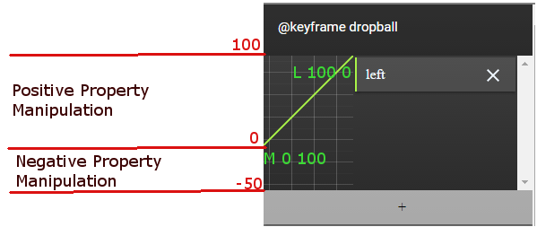
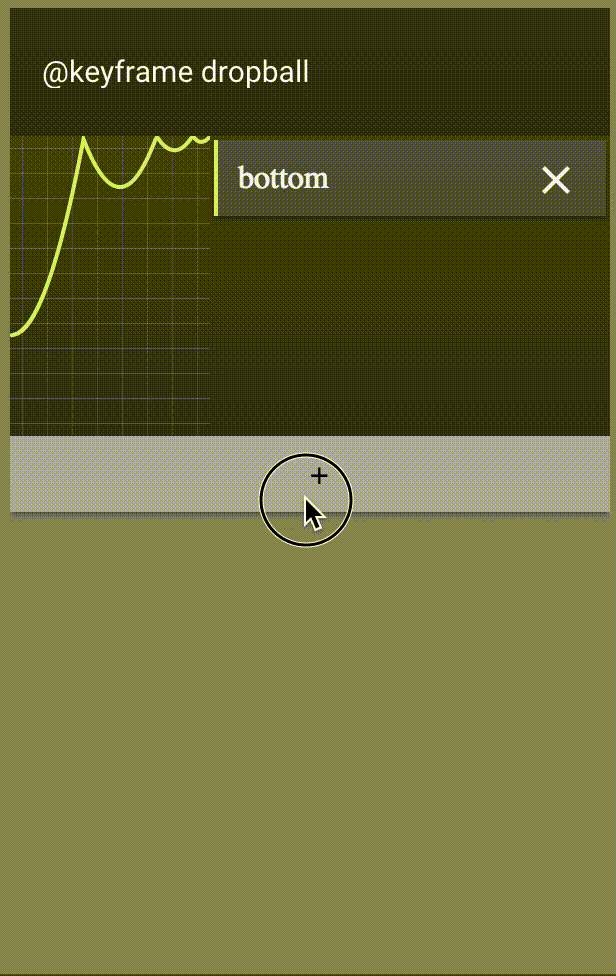
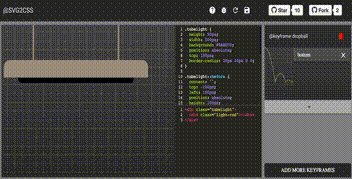
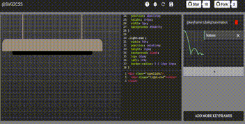
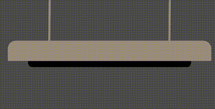

# Tutorials for SVG2CSS

### What is this web-application used for?

The main purpose of this web-app is to help the user build complex css animations. The user needs to create a keyframe, provide the keyframe with a property, say `left` or `top` or any other css property, and a svg path indicating what should be hapenning with that particular property, along with the unit that the property uses and its min and max value. If the property follows a non-numerical value, the user can choose the `1's and 0's` checkbox and put the `String` values in min and max input field. This way, if the curve is on the top, it will choose the max value and vice versa. I will be showing a demo of `1's and 0's` checkbox in the later section.

#### Using the SVG Grid

The SVG grid is like any other graph paper that you guys might have used while studying trigonometry. I build the grid with the same concept. The bottom-left corner of the grid is `0,0` and the grid follows till `100,100` in the positive axis and `100, -50` in the negative axis.

In terms of SVG, a user can build the SVG point at location `M 0 100`. Please refer the following image for the grid.

I would suggest using the `-ve` section of the grid only when you need to deal with elastic properties, but other than that, please use the `min` and `max` values.

#### transform Properties

In order to add any property in the `keyframe`, the user simply needs to add that property along with its SVG path. In order to add a transform property, the user needs to add the `<transform-function>` instead of the property. For example:

- Lets say you want to add `transform: rotateX()` to the property list in the `keyframe`; what you do is, you add `rotateX` in property name, and add SVG path for this function.

The SVG keyframe element is intelligent enough to understand what properties are part of transform function. The `<transform-function>`s supported in `keyframe` are as follows:

| CSS property you want to write | Transform Function | What you will write |
|--------------------------------|--------------------|---------------------|
| `transform: translateX()`      | `translateX()`     |  `translateX`       |
| `transform: translateY()`      | `translateY`       |  `translateY`       |
| `transform: translateZ()`      | `translateZ`       |  `translateZ`       |
| `transform: scale()`           | `scale`            |  `scale`            |
| `transform: scaleX()`          | `scaleX`           |  `scaleX`           |
| `transform: scaleY()`          | `scaleY`           |  `scaleY`           |
| `transform: scaleZ()`          | `scaleZ`           |  `scaleZ`           |
| `transform: rotate()`          | `rotate`           |  `rotate`           |
| `transform: rotateX()`         | `rotateX`          |  `rotateX`          |
| `transform: rotateY()`         | `rotateY`          |  `rotateY`          |
| `transform: rotateZ()`         | `rotateZ`          |  `rotateZ`          |
| `transform: skew()`            | `skew`             |  `skew`             |
| `transform: skewX()`           | `skewX`            |  `skewX`            |
| `transform: skewY()`           | `skewY`            |  `skewY`            |
| `transform: perspective()`     | `perspective`      |  `perspective`      |

*Please Note* : Even if you add multiple `<transform-function>`s separately, the `keyframe` is intelligent enough to combine them into a single `transform` property.

## Demo

### Moving ball demo a.k.a. Projectile Demo

In this demo, the user decides to modify the default code and keyframes by making the ball move forward.

##### Step 1

- `Refresh` / Play the animation with the refresh button.

##### Step 2

- Click on the `+` button in the *keyframes* section to view the property add section.
- Add the SVG path for the property
- Add the property you want to change, and its details like unit, min and max values
- Click on the `Add Property` button to add the property to the *keyframes*

##### Step 3

- Click on the `Refresh` button to see the changes in animation

### Light Flicker Demo

This demo shows how you can use the `1's and 0's` checkbox to build a flickering light demo.

##### Step 1

- Build the demo without any animations.
- Add the `@keyframe` that you want to use.
 

##### Step 2

- Decide how you want to apply the animation. I decided to use `background` property to switch on and off the light. So whenever the SVG has a `1`, it will switch on the light and vice versa. I decided to apply the same SVG to `box-shadow` property. This way, it will show the area around the light to brighten whenever the light is on.
- Add those properties, but also click on the `refresh` icon to see if you broke anything in your demo.
- Once you have added the property, add the `animation` in your css.

 

##### Step 3

- Play around with the properties until you have what you need. I modified mine a little bit, and this is the final output.
 

Here is the [working demo of the tubelight on codepen](http://codepen.io/prateekjadhwani/pen/VawZbd).

### Saving Your Changes

If you would like to save your changes you can simply click on the save icon on the top, and the app will let you save the css in your [gists](https://gist.github.com/).

### Bugs and Issues

If you think there is an bug in the webapp, please feel free to file an issue by clicking on the bug icon right next to the save icon. Similarly, you can file for new features.
